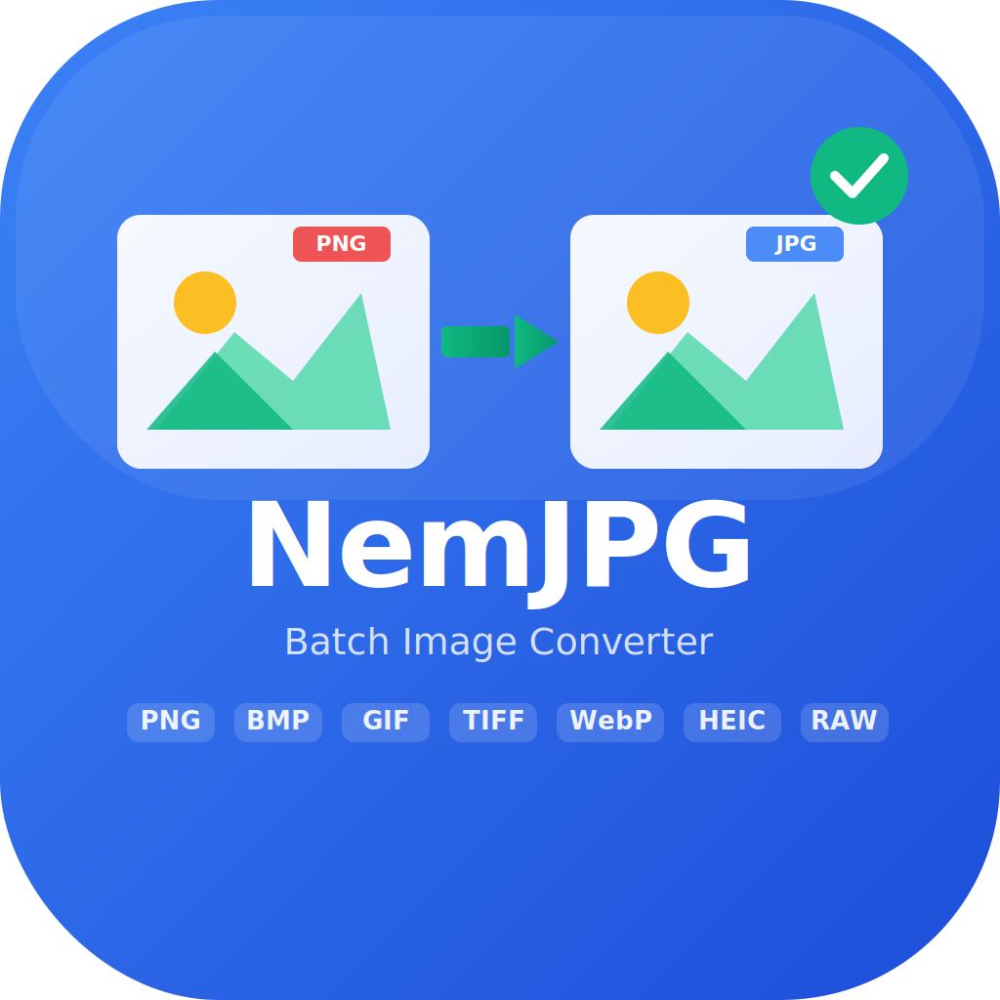

<p align="center">
  
</p>

<h1 align="center">NemJPG</h1>

<p align="center">
  <strong>Batch image converter for macOS and Windows</strong><br>
  Convert 20+ image formats to JPG, PNG, WebP, or TIFF in seconds.
</p>

<p align="center">
  <a href="https://hejmadi.com/NemJPG/">Website</a> &middot;
  <a href="#download">Download</a> &middot;
  <a href="#supported-formats">Formats</a>
</p>

---

## About

NemJPG is a free, open-source batch image converter that processes everything locally on your machine. No uploads, no accounts, no bloatware. Just fast, reliable image conversion.

- **macOS**: Native SwiftUI app with drag-and-drop support
- **Windows**: Lightweight script with right-click context menu integration

## Features

- Convert 20+ image formats to JPG (and more)
- Batch processing -- convert hundreds of images at once
- Drag and drop files or entire folders (macOS)
- Right-click context menu integration (Windows)
- Configurable quality settings (high, medium, web, compressed)
- Optional image resizing with preserved aspect ratio
- Transparent PNG backgrounds handled automatically (white fill)
- File size report showing space saved per image
- All processing done locally -- no data leaves your machine
- Free and open source

## Screenshots

<p align="center">
  
</p>

<p align="center">
  
</p>

## Download

### macOS

Download NemJPG from the [Mac App Store](#) or build from source:

```bash
cd macOS
swift build
```

**Requirements:** macOS 13 Ventura or later. Supports Apple Silicon and Intel.

### Windows

1. Download `Konverter til JPG.bat` from the [website](https://hejmadi.com/NemJPG/)
2. Place the file in the folder containing your images
3. Double-click to convert all images to JPG

For right-click context menu integration, run the Windows installer.

**Requirements:** Windows 10 or later. PowerShell 5.1+ (built-in).

## Supported Formats

### Standard Formats
| Format | Extension |
|--------|-----------|
| PNG | `.png` |
| BMP | `.bmp` |
| GIF | `.gif` |
| TIFF | `.tiff`, `.tif` |
| WebP | `.webp` |
| ICO | `.ico` |
| JPEG 2000 | `.jp2` |
| PSD | `.psd` |

### Apple / Modern Formats
| Format | Extension |
|--------|-----------|
| HEIC | `.heic` |
| HEIF | `.heif` |
| AVIF | `.avif` |

### RAW Camera Formats
| Format | Camera | Extension |
|--------|--------|-----------|
| DNG | Adobe | `.dng` |
| CR2 | Canon | `.cr2` |
| NEF | Nikon | `.nef` |
| ARW | Sony | `.arw` |
| ORF | Olympus | `.orf` |
| RAW | Generic | `.raw` |

> **Note (Windows):** HEIC/HEIF and AVIF support requires codecs from the Microsoft Store (often pre-installed on Windows 10/11). RAW formats require camera-specific codecs.

## System Requirements

| | macOS | Windows |
|---|---|---|
| **OS** | macOS 13 Ventura+ | Windows 10/11 |
| **Architecture** | Apple Silicon & Intel | x64 |
| **Runtime** | None (native SwiftUI) | PowerShell 5.1+ (built-in) |
| **Price** | Free | Free |

## Building from Source

### macOS

```bash
cd macOS
swift build
swift run NemJPG
```

### Windows

No build step required. The `.bat` file is the complete application.

## License

[MIT License](LICENSE) -- Copyright 2026 Michael Skov Hejmadi

## Links

- **Website:** [hejmadi.com/NemJPG](https://hejmadi.com/NemJPG/)
- **Author:** [Michael Skov Hejmadi](https://hejmadi.com)
- **GitHub:** [github.com/DrHejmadi/NemJPG](https://github.com/DrHejmadi/NemJPG)
